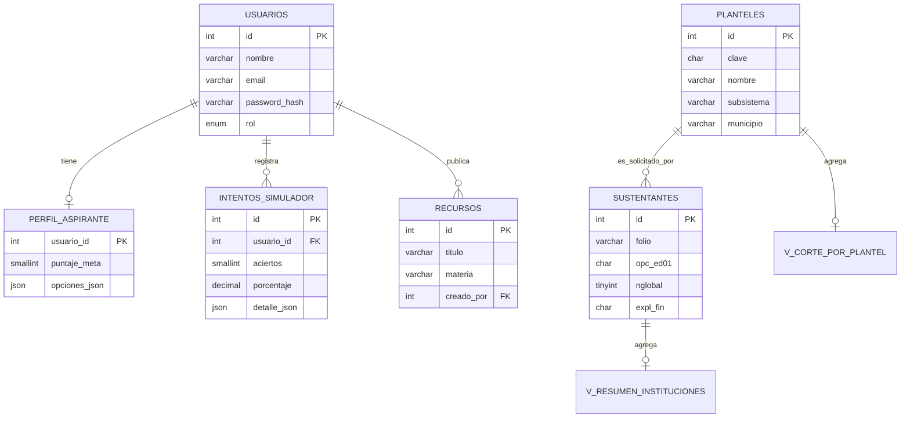

# Entregable: modelo de datos y búsqueda, Portal ECOEMS

Proyecto: Portal de Consulta Histórica ECOEMS
Materia: Desarrollo de Aplicaciones Web, Licenciatura en Ciencia de Datos, IPN

Este documento describe el modelo de datos implementado, los criterios de búsqueda
disponibles, el algoritmo de coincidencia usado y la forma en que el portal se conecta a la
base de datos y extrae información en formato XML.

## 1. Modelo de datos y esquemas implementados

La base de datos `proyectoequc` (MariaDB) está compuesta por las siguientes tablas y vistas.

| Objeto | Tipo | Propósito |
|---|---|---|
| `sustentantes` | Tabla | Registro histórico de aspirantes al concurso: datos demográficos, las 20 opciones solicitadas, resultados del examen por área y la asignación final. Es la tabla de mayor volumen. |
| `planteles` | Tabla | Catálogo de opciones educativas (clave, nombre, especialidad, subsistema, ubicación y coordenadas). |
| `usuarios` | Tabla | Cuentas del portal (aspirante o admin), con autenticación propia. |
| `recursos` | Tabla | Biblioteca de guías y enlaces de estudio, administrable por rol admin. |
| `intentos_simulador` | Tabla | Historial de resultados del examen simulador por usuario. |
| `perfil_aspirante` | Tabla | Opciones de interés y puntaje meta de cada aspirante. |
| `v_corte_por_plantel` | Vista | Puntaje de corte mínimo, máximo y promedio por plantel, calculado a partir de `sustentantes`. |
| `v_resumen_instituciones` | Vista | Totales agregados (aspirantes, asignados, promedio) por institución asignada. |

Las vistas existen para no recalcular agregaciones costosas sobre `sustentantes` cada vez que
se consultan estadísticas: encapsulan el `GROUP BY` y se consultan como si fueran tablas.

## 2. Modelo relacional



Cardinalidades principales:

- `usuarios` 1 a 1 `perfil_aspirante` (clave foránea `usuario_id`, también primaria en
  `perfil_aspirante`, `ON DELETE CASCADE`).
- `usuarios` 1 a N `intentos_simulador` (`ON DELETE CASCADE`: al borrar la cuenta se borra su
  historial).
- `usuarios` 1 a N `recursos` (campo `creado_por`, `ON DELETE SET NULL`: si se borra el autor,
  el recurso permanece sin autor asociado).
- `planteles` y `sustentantes` se relacionan de forma lógica, no por clave foránea declarada:
  los campos `opc_ed01` a `opc_ed20` de `sustentantes` y `opc_ed01` (o `clave_plantel` en las
  vistas) almacenan la `clave` del plantel solicitado. El vínculo se resuelve en tiempo de
  consulta mediante `JOIN` o subconsultas, ya que `sustentantes` se carga en bloque desde CSV
  oficiales sin garantía de integridad referencial declarada a nivel de motor.

## 3. Modelo de objetos

A nivel de aplicación, cada fila de la base de datos se traduce en un objeto plano cuando viaja
del backend al frontend, siguiendo siempre el mismo sobre de respuesta:

```json
{ "status": "ok", "datos": { } }
```

Entidades conceptuales y su representación:

| Entidad | Representación en PHP | Representación en JS |
|---|---|---|
| Usuario | arreglo asociativo PDO (`id, nombre, email, rol`) | objeto `usuario` guardado en `localStorage`/sesión |
| Perfil del aspirante | fila de `perfil_aspirante` + arreglo de planteles resueltos | objeto `{ puntaje_meta, meta_sugerida, opciones: [] }` |
| Plantel | fila de `planteles` | objeto `{ clave, nombre, subsistema, municipio, ... }` |
| Sustentante | fila agregada de `sustentantes` (nunca se expone el registro individual completo, solo agregados) | objetos de estadística (`puntaje_corte_prom`, `total_solicitudes`, etc.) |
| Recurso | fila de `recursos` | tarjeta de la biblioteca |
| Intento de simulador | fila de `intentos_simulador`, con `detalle_json` decodificado a objeto | objeto `{ aciertos, total, porcentaje, detalle: { materia: { ok, tot } } }` |

El backend usa `PDO::FETCH_ASSOC` de forma uniforme (definido una sola vez en
`backend/config.php`, función `getDB()`), por lo que cada fila ya llega como arreglo
asociativo listo para `json_encode()`.

## 4. Tipos de datos

| Tabla | Campo | Tipo SQL | Notas |
|---|---|---|---|
| `planteles` | `clave` | `CHAR(7)` | Identificador único, formato fijo tipo `U611000` |
| `planteles` | `nombre` | `VARCHAR(120)` | |
| `planteles` | `subsistema` | `VARCHAR(50)` | Valores como UNAM, IPN, CONALEP |
| `planteles` | `latitud`, `longitud` | `DECIMAL(9,6)` | Coordenadas geográficas para el mapa |
| `usuarios` | `password_hash` | `VARCHAR(255)` | Hash, nunca la contraseña en claro |
| `usuarios` | `rol` | `ENUM('aspirante','admin')` | Tipo enumerado, restringe valores válidos |
| `intentos_simulador` | `porcentaje` | `DECIMAL(5,2)` | Hasta 999.99, dos decimales |
| `intentos_simulador` | `detalle_json` | `JSON` | Estructura libre, validada en aplicación, no en motor |
| `perfil_aspirante` | `opciones_json` | `JSON` | Arreglo de claves de plantel, máximo 5 |
| `sustentantes` | `nglobal`, `nhv`, etc. | `TINYINT UNSIGNED` | Aciertos por área, rango 0 a 128 según el campo |
| `sustentantes` | `promedio` | `DECIMAL(4,1)` | Promedio de certificado de secundaria |
| `recursos` | `tipo` | `ENUM('enlace','pdf')` | |
| (todas) | `creado`, `fecha`, `actualizado` | `DATETIME` | Marca de tiempo con valor por defecto `CURRENT_TIMESTAMP` |

## 5. Criterios de búsqueda

| Módulo | Endpoint | Criterios disponibles |
|---|---|---|
| Catálogo de planteles | `backend/api/planteles.php`, `backend/api/planteles_xml.php` | (1) texto libre sobre clave o nombre, (2) subsistema/institución, (3) municipio o alcaldía |
| Consulta por escuela | `backend/api/escuela.php` | clave de plantel exacta, o texto libre |
| Comparador | `backend/api/comparar.php` | lista de claves de plantel (1 a 5) |
| Resumen estadístico | `backend/api/resumen.php` | institución asignada |
| Mis opciones y meta | `backend/api/metas.php` | claves de plantel de interés del usuario en sesión |

El catálogo de planteles (`frontend/planteles.php`) es la búsqueda principal del portal y
combina explícitamente **tres criterios simultáneos**: texto, institución y municipio.

## 6. Algoritmo de coincidencia entre la búsqueda del usuario y los datos

La coincidencia ocurre en dos niveles: en el servidor (consulta SQL parametrizada) y en el
cliente (filtrado adicional sobre el resultado ya cargado), según el endpoint.

**Coincidencia por prefijo vs. por subcadena.** Para el campo `clave` se usa coincidencia de
prefijo (`LIKE 'texto%'`), porque las claves siguen un patrón estructurado (institución +
número) y el usuario normalmente empieza a teclear desde el inicio. Para `nombre` y
`subsistema` se usa coincidencia de subcadena (`LIKE '%texto%'`), porque el usuario puede
recordar solo una palabra intermedia del nombre del plantel.

Pseudocódigo del filtrado combinado (los tres criterios se aplican con **AND lógico**: un
plantel solo aparece si cumple los tres a la vez, cuando los tres están presentes):

```
función buscarPlanteles(texto, institucion, municipio, catalogo):
    resultado = catalogo
    si texto no es vacío:
        textoNormalizado = minusculas(texto)
        resultado = resultado donde
            clave EMPIEZA_CON textoNormalizado
            O nombre CONTIENE textoNormalizado
            O subsistema CONTIENE textoNormalizado
    si institucion no es vacío:
        resultado = resultado donde subsistema = institucion
    si municipio no es vacío:
        resultado = resultado donde municipio = municipio
    regresar resultado
```

En el servidor (`planteles.php`, `planteles_xml.php`) el mismo principio se traduce a SQL
parametrizado:

```sql
SELECT clave, nombre, especialidad, subsistema, municipio, estado, direccion, latitud, longitud
FROM planteles
WHERE (clave LIKE :q OR nombre LIKE :q2)
  AND subsistema = :subsistema
  AND municipio = :municipio
```

Las condiciones se agregan dinámicamente solo si el criterio correspondiente viene presente en
la petición, evitando filtrar por un campo vacío. Siempre se usan **prepared statements**
(`PDO::prepare`/`execute`) para evitar inyección SQL; el texto del usuario nunca se concatena
directo en la consulta.

Para las estadísticas (`v_corte_por_plantel`, `v_resumen_instituciones`) la "coincidencia" es
una agregación: se agrupa `sustentantes` por la clave de plantel u institución y se calculan
`MIN`, `MAX`, `AVG` sobre los aciertos (`nglobal`) de quienes fueron asignados (`expl_fin =
'ASI'`), en vez de comparar texto.

## 7. Aplicación funcional con al menos 3 criterios

`frontend/planteles.php` implementa la búsqueda de 3 criterios de forma visible e interactiva:

1. Campo de texto libre (clave o nombre), con autocompletado.
2. Botones de filtro por institución (subsistema), generados dinámicamente a partir del
   catálogo cargado.
3. Selector de municipio o alcaldía, también generado dinámicamente.

Los tres criterios se combinan en el cliente sobre el catálogo ya descargado
(`backend/api/planteles.php`), y el mismo conjunto de criterios puede exportarse a XML con el
botón "Exportar a XML", que llama a `backend/api/planteles_xml.php` con los filtros activos
como parámetros de URL.

## 8. Conexión con la base de datos y extracción de datos en XML

**Conexión.** `backend/config.php` define `getDB()`, que crea y memoiza una única conexión PDO
a MariaDB (`mysql:host=...;dbname=...;charset=utf8mb4`), en modo de errores por excepción y
con `fetch` en modo asociativo por defecto. Todos los endpoints de `backend/api/` llaman a esta
misma función, por lo que la conexión se abre una sola vez por petición HTTP.

**Extracción a XML.** `backend/api/planteles_xml.php` consulta `planteles` con los mismos tres
criterios de búsqueda descritos arriba y construye el documento con la extensión `DOMDocument`
de PHP (no concatenación manual de cadenas, para garantizar XML bien formado y con escape
automático de caracteres especiales). Estructura de salida:

```xml
<?xml version="1.0" encoding="UTF-8"?>
<planteles total="3" generado="2026-06-24T20:00:00+00:00">
  <plantel>
    <clave>U611000</clave>
    <nombre>ENP 4 "Vidal Castañeda y Nájera"</nombre>
    <especialidad>Bachillerato general</especialidad>
    <subsistema>UNAM</subsistema>
    <municipio>Miguel Hidalgo</municipio>
    <estado>Ciudad de México</estado>
    <direccion>Col. Popotla, C.P. 11400</direccion>
    <latitud>19.404028</latitud>
    <longitud>-99.195565</longitud>
  </plantel>
  <!-- ... -->
</planteles>
```

El endpoint admite `?descargar=1` para forzar la descarga del archivo en lugar de mostrarlo en
el navegador, mediante la cabecera `Content-Disposition: attachment`.
